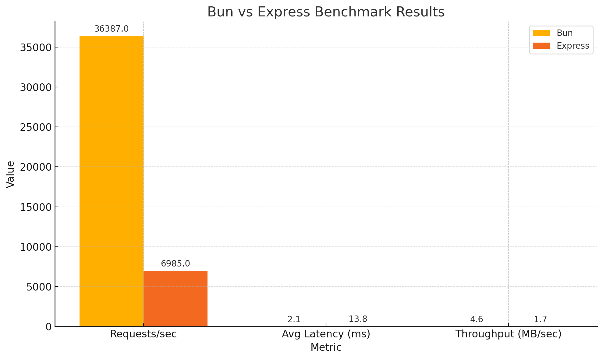

# 🚀 bun-vs-express-performance

A simple benchmark comparing the performance of [Bun](https://bun.sh) and [Express (Node.js)](https://expressjs.com) in a basic HTTP server scenario.

The goal is to test real-world performance using tools like `autocannon`, measuring key metrics such as:
- Requests per second (RPS)
- Average latency
- CPU and memory usage

## 📁 Project Structure
```bash
bun-vs-express-performance/
├── bun-server/
│ └── index.ts # HTTP server using Bun's native API
├── express-server/
│ └── index.js # HTTP server using Express and Node.js
├── benchmarks/
│ └── results.md # Raw results and analysis
└── run-benchmarks.js
└── README.md
```

## ⚙️ Getting Started

### 1. Clone the repo
```bash
git clone https://github.com/DaniInarejos/bun-vs-express-performance.git
cd bun-vs-express-performance
```
### 2. Install dependencies
Make sure you have:
[Bun](https://bun.sh)
[Node.js](https://nodejs.org/es)
autocannon (if not installed):

```bash
npm install -g autocannon
```
in folder ./bun-vs-express-performance

```bash
npm install
```

###  3. Run the full benchmark with one command
```bash
node run-benchmarks.js
```
This will:

Start both servers (Bun and Express)

Run autocannon against each

Output the results in the console

Stop both servers automatically

## 📊 Results- Visual Comparison
See [benchmarks/RESULTS.md](benchmarks/RESULTS.md) for detailed stats.




## 🧠 Conclusion
Bun shows promising performance gains for basic HTTP servers, especially in throughput and latency.
This benchmark offers a simple yet informative comparison to help developers evaluate switching to Bun.

