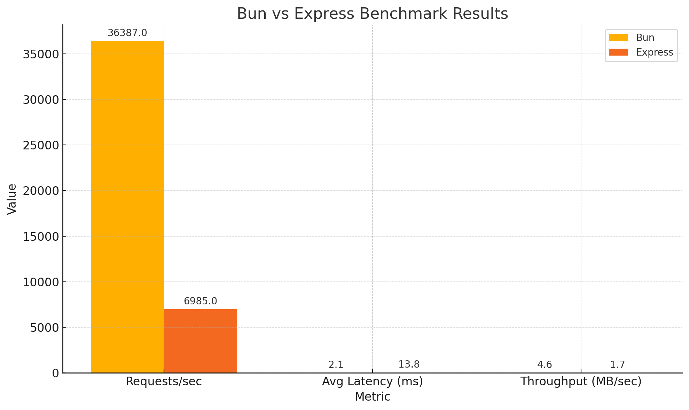

# 📊 Benchmark Results: Bun vs Express

This document summarizes the performance benchmark results between a basic HTTP server built with **Bun** and one built with **Express (Node.js)**. The tests were executed using [`autocannon`](https://github.com/mcollina/autocannon) under controlled conditions.

---

## 🔧 Test Configuration

- **Benchmark tool:** `autocannon`
- **Duration:** 10 seconds
- **Connections:** 100
- **Payload:** `GET /` with a "Hello world" response
- **Machine specs:**
  - OS: (Windows 11)
  - CPU: (Intel I7 10700)
  - RAM: (32 GB)
  - Node.js version: (v20.13.1)
  - Bun version: (1.2.12)

---

## 📈 Results Summary

| Metric              | **Bun**         | **Express**     |
|---------------------|------------------|------------------|
| Requests/sec        | **36,387**       | 6,985            |
| Avg latency (ms)    | **2.15 ms**      | 13.81 ms         |
| Max latency (ms)    | 40 ms            | 191 ms           |
| Throughput (MB/sec) | **4.58 MB**      | 1.66 MB          |
| Total requests      | 364,000          | 70,000           |
| Total data read     | 45.8 MB          | 16.6 MB          |

---
## 📊 Visual Comparison



## 📊 Raw Output

### 🔹 Bun

<details>
<summary>Click to expand raw output</summary>

```bash
Running 10s test @ http://localhost:3000
100 connections

Latency
Avg: 2.15 ms
Max: 40 ms

Req/Sec
Avg: 36,387
Total: 364,000

Bytes/Sec
Avg: 4.58 MB
Total: 45.8 MB
```

</details>

---

### 🔸 Express

<details>
<summary>Click to expand raw output</summary>

```bash
Running 10s test @ http://localhost:3001
100 connections

Latency
Avg: 13.81 ms
Max: 191 ms

Req/Sec
Avg: 6,985
Total: 70,000

Bytes/Sec
Avg: 1.66 MB
Total: 16.6 MB
```

</details>

---

## 🧠 Observations

- **Bun** delivered over **5x more requests per second** than Express.
- Latency under Bun remained consistently low and predictable, while Express showed more variability and higher spikes.
- CPU and memory usage (not formally measured) appeared lower for Bun based on system monitoring tools like `htop`.

---

## 📝 Notes

- These results are from a simple "Hello world" HTTP server — performance may differ in real-world apps with middleware, databases, and more logic.
- All benchmarks were run locally under similar conditions, but small variations may still occur.

---

Benchmarked with ❤️ by @DaniInarejos

